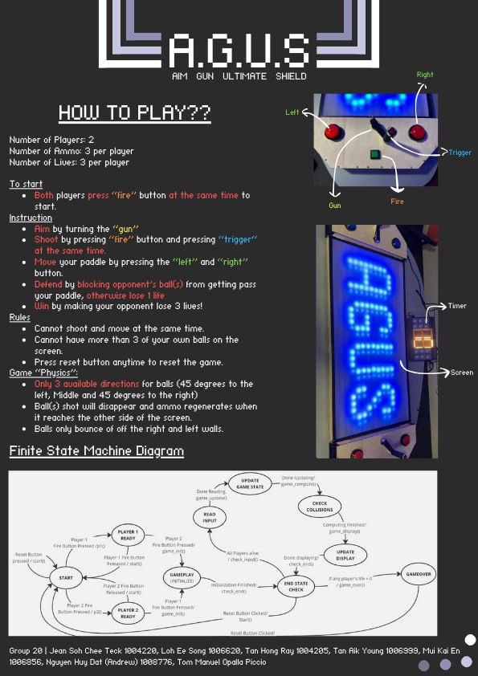

# Aim Gun Ultimate Shield
## Project Description

Introducing Aim Gun Ultimate Shield, or A.G.U.S in short, our 2 player pong-inspired game. A.G.U.S is built using the Beta CPU datapath with slight modification. The actual game logic is done with Beta ISA. The game interface features a 30x15 LED screen, and 6 LEDs per player. Each player controls a paddle with 4 inputs (move left, move right, aim, shoot). Players must shoot balls at the opponent’s goal to score while blocking incoming balls from the opponent. The winner is the player who scores 3 goals before your opponent does so.

## Gameplay

See this [link](https://youtube.com/shorts/LJnXTqgI8Tg?feature=share).

## Technologies Used

### Hardware

* Alchitry Au + Alchitry Io Element Board
* Custom PCB, WS2812B LED strip (used for screen), buttons for players

### Software

* Alchitry Labs + Vivaldo
* Lucid, Beta ISA 
 
Using Lucid hardware description language, we programmed the datapath of a RISC based CPU, comprising of the ALU, Control Unit, RAM, Regfile, and PC unit. Using this CPU, we used the Beta Assembly Language to program the game. 

Beta Assembly is a custom 32 bit instruction set with 32 instructions made specially for the 50.002 Computation Structures course. See the ```assets/beta_instruction_summary.pdf``` for the CPU datapath and Beta ISA. 

### Memory Mapped I/O 
Instead of using a input buffer, we mapped 4 specific registers to the ammo and lives LED for both players. The LED will be connected directly to these registers through some combinational logic that takes an input value of [0,3] and decides which LEDs should light up. The instructions will also update these values in the game logic.

Each player has 4 inputs: move left, move right, aim and fire. In total, both players would have 8 inputs. The inputs are mapped directly to a dedicated location in RAM, where the Beta Assembly code reads the input from that location as if it was an array in RAM. To update the inputs, the CPU periodically checks for inputs at that dedicated location (polling) and uses it for game logic.

## Installation

Without the hardware mentioned above, it is impossible to play the game.

## Poster



## Acknowledgements
This project would not be possible without Jean Soh Chee Teck, Tan Hong Ray, Tan Aik Young, Mui Kai En, Nguyen Huy Dat (Andrew) and Tom Manuel Opalla Piccio. Thanks for the great work!